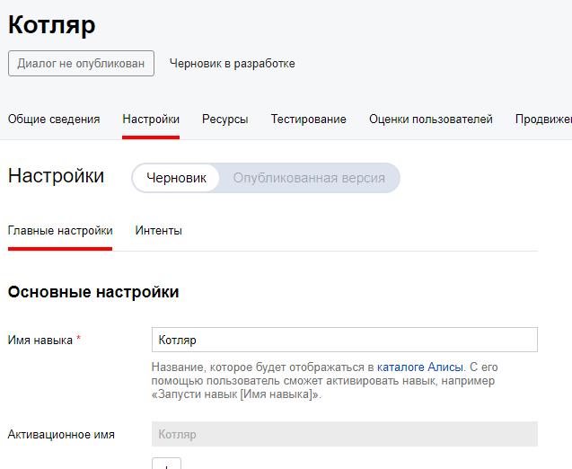
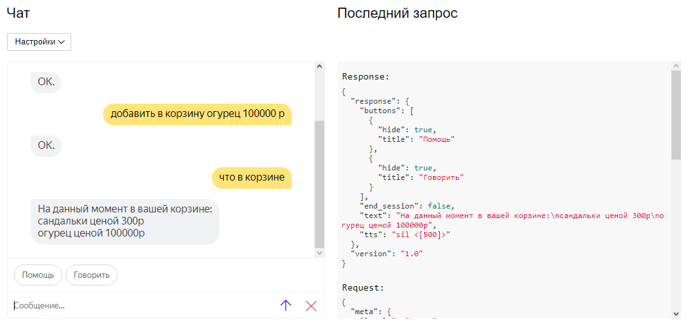
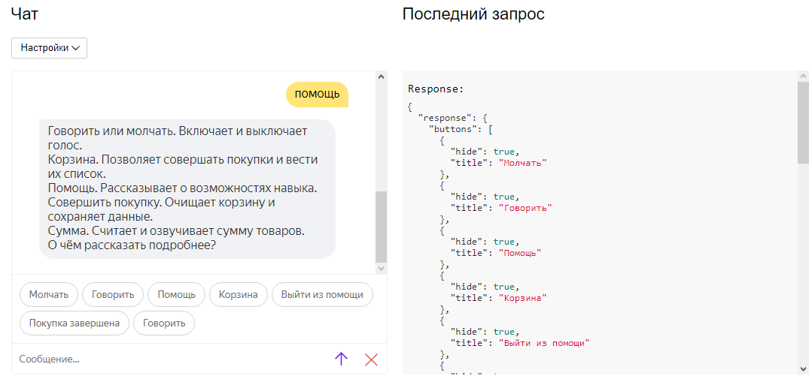
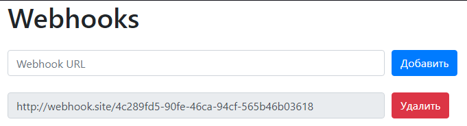

<p align="center">МИНИСТЕРСТВО НАУКИ  И ВЫСШЕГО ОБРАЗОВАНИЯ РОССИЙСКОЙ ФЕДЕРАЦИИ<br>
Федеральное государственное автономное образовательное учреждение высшего образования<br>
"КРЫМСКИЙ ФЕДЕРАЛЬНЫЙ УНИВЕРСИТЕТ им. В. И. ВЕРНАДСКОГО"<br>
ФИЗИКО-ТЕХНИЧЕСКИЙ ИНСТИТУТ<br>
Кафедра компьютерной инженерии и моделирования</p>
<br>
<h3 align="center">Отчёт по лабораторной работе № 2<br> по дисциплине "Программирование"</h3>
<br><br>
<p>студента 1 курса группы ПИ-б-о-201(2)<br>Котляра Даниила Евгеньевича<br>
направления подготовки 09.03.04 "Программная инженерия"</p>
<br><br>
<table>
<tr><td>Научный руководитель<br> старший преподаватель кафедры<br> компьютерной инженерии и моделирования</td>
<td>(оценка)</td>
<td>Чабанов В.В.</td>
</tr>
</table>
<br><br>
<p align="center">Симферополь, 2021</p>
<hr>

## Цель
1. Получить представления о структуре post-запроса;
2. Изучить webhooks как метод взаимодействия web-приложений;

## Постановка задачи

Разработать и зарегистрировать навык для Алисы на сервисе Яндекс.Диалоги;

В качестве backend-a для навыка реализовать приложение на языке С++ выполняющее следующие функции:

- Составление продуктовой корзины:
    - Добавление продукта в корзину;
    - Удаление продукта из корзины;
    - Очистка корзины;
    - Вывод списка товаров в корзине;
    - Подсчёт стоимости товаров в корзине.

- Вывод справочной информации по навыку;

- Регистрацию webhook-ов сторонних сервисов;

- Отправку данных на сторонние сервисы. 

В качестве стороннего сервиса реализовать приложение на языке Python, выполняющее следующие функции:
    Ожидание данных о покупке;
    Сохранение поступивших данных в excel-документ.

## Выполнение работы
<!--
    Скриншот со страницы настроек навыка (должно быть видно название);
    Демонстрация работы функционала Корзина (достаточно скриншота с диалогом);
    Демонстрация работы функционала Помощь (достаточно скриншота с диалогом);
    Скриншот страницы управления webhook-ами с добавленным webhook-ом клиентского приложения;
    Ссылка на excel-файл заполненный клиентским приложением. Сам файл разместить в репозитории. Не обязательно делать 1000 записей, размер буфера можно уменьшить;
    Полный исходный код серверного приложения;
    Полный исходный код клиентского приложения;
-->
<!-- data.xlsx  default-mode.png  help-mode.png  settings-screenshot.png  webhooks.png -->

В начале работы был создан навык на странице яндекса. Название было выбрано лаконичное, чётко отражающее суть навыка -- "Корзина".



Рисунок 1. Скриншот настроек.

Далее была написана логика работы с диалогом Yandex.

В основном использовалось поле в запросе "command", которое содержит текст сообщения в нижнем регистре и очищенный от знаков препинания.

Для получения цены использовалась функция выделения сущностей в сообщении. К примеру, яндекс может определить улицу в сообщении пользователя, человека или число.
Пригодилось ещё поле, разделяющее command по словам в один массив. Из него программа получает название товара после фразы "добавь в корзину" до начала числа,
которое получается из данных сущности.

К сожалению, найти в документации способ заставить молчать Алису не был найден, поэтому применён костыль в виде инструкции произнести паузу между слов.



Рисунок 2. Скриншот диалога в обычном режиме.



Рисунок 3. Скриншот диалога в режиме помощи.

Веб-страница управления вебхуками генерируется простейшим образом. Для каждого вебхука из конфигурационного файла ссылка на вебхук заменяется 
в шаблоне для вебхука и добавляется в конец временной строки. После этой временной строкой заменяется место, предназначенное для списка вебхуков.



Рисунок 4. Скриншот панели управления вебхуками.

Далее было написано приложение на Python, которое получает json от сервера на C++ и добавляет каждый предмет как отдельную строку в буфер.
Если размер буфера превышает определённое число (1000 строк), то строки из буфера переносятся в документ excel и в клетку F1 записывается число --
следующая строка для записи в excel.

Ссылка на файл excel:

[Python/data.xlsx](Python/data.xlsx)

Ссылка на исходный код на C++:

Инициализация сервера: [Alice.cpp](C++/Alice/Alice.cpp)

Исходный код C++:
Alice.cpp
```cpp
#include <iostream>
#include <fstream>
#include "cpp-httplib/httplib.h"
using namespace httplib;

void webhooks_get(const Request& req, Response& res);
void webhooks_post(const Request& req, Response& res);
void yandex_hook(const Request& req, Response& res);

int main() {
	Server srv;
	srv.Get("/webhooks", webhooks_get);
	srv.Post("/webhooks", webhooks_post);
	srv.Post("/yandex_hook", yandex_hook);
	srv.listen("localhost", 3000);
}
```
server.cpp
```cpp
#include <iostream>
#include <string>
#include "nlohmann/json.hpp"
#include "cpp-httplib/httplib.h"

using json = nlohmann::json;
using namespace httplib;
using namespace std;

// Заменить в переменной 'data' строку 'to_replace' строкой 'replace_with'
void replace_all(string& data, const string& to_replace, const string& replace_with) {
	size_t pos = data.find(to_replace);
	while (pos != string::npos) {
		data.replace(pos, to_replace.size(), replace_with);
		pos = data.find(to_replace, pos + replace_with.size());
	}
}

string webhook_template = R"(
<div class="form-row align-items-center">
    <div class="col">
        <input type="text" value="{Webhook URL}" class="form-control mb-2" disabled>
    </div>

    <div class="col">
        <button type="submit" name="del" value="{Webhook URL}" class="btn btn-danger mb-2">Удалить</button>
    </div>
</div>)";

json config, return_json;

json get_config() {
	ifstream config_file("config.json");
	if (config_file.is_open()) {
		config_file >> config;
		config_file.close();
	}
	else {
		cout << "Ошибка доступа к файлу.\n";
		return_json["webhooks"] = json::array();
		return return_json;
	}
	return config;
}

void save_config(json config) {
	ofstream config_file("config.json");
	if (config_file.is_open()) {
		cout << "Пишем файл конфигурации...\n";
		config_file << config.dump(4);
		config_file.close();
	}
	else
		cout << "Не удалось создать файл.\n";
}

string gen_webhook_page() {
	ifstream webpage_file("webhooks.html");
	string webpage;
	if (webpage_file.is_open()) {
		getline(webpage_file, webpage, '\0');
		webpage_file.close();
	}
	else {
		cout << "Ошибка доступа к файлу.\n";
		return "";
	}
	if (config.empty())
		config = get_config();
	string webhook_list, wb_tp;
	if (!config["webhooks"].empty())
		for (auto webhook : config["webhooks"])
			if (webhook.is_string()) {
				wb_tp = webhook_template;
				replace_all(wb_tp, "{Webhook URL}", webhook.get<string>());
				webhook_list += wb_tp;
			}
			else
				cout << "Ошибка: Проверьте конфигурационный файл. Был обнаружен " << webhook << " с типом данных '" << webhook.type_name() << "'. Ожидалась строка.\n";
	replace_all(webpage, "{webhooks_list}", webhook_list);
	return webpage;
}

void webhooks_get(const Request& req, Response& res) {
	res.set_content(gen_webhook_page(), "text/html; charset=UTF-8");
	cout << endl;
}

void webhooks_post(const Request& req, Response& res) {
	if (config.empty())
		config = get_config();
	if (req.has_param("del")) {
		string value = req.get_param_value("del");
		if (value == "")
			cout << "Инфо: Пустой запрос на удаление вебхука." << endl;
		else {
			cout << "Инфо: В POST получен параметр del=" << value << endl;
			if (!config["webhooks"].empty())
				for (auto i = config["webhooks"].begin(); i != config["webhooks"].end(); ++i)
					if (i->is_string() && i->get<string>() == value) {
						cout << "Инфо: вебхук " << i->get<string>() << " найден в конфигурации и был удалён." << endl;
						config["webhooks"].erase(i);
						break;
					}
					else
						cout << "Инфо: Вебхуки отсутствуют. Нечего удалять!" << endl;
		}
	}
	else if (req.has_param("set")) {
		string value = req.get_param_value("set");
		if (value != "")
			if (!config["webhooks"].empty()) {
				bool webhook_exist = false;
				for (auto i = config["webhooks"].begin(); i != config["webhooks"].end(); ++i)
					if (i->is_string() && i->get<string>() == value) {
						webhook_exist = true;
						break;
					}
				if (!webhook_exist)
					config["webhooks"].push_back(value);
			}
			else
				config["webhooks"].push_back(value);
	}
	save_config(config);

	res.set_content(gen_webhook_page(), "text/html; charset=UTF-8");
}

enum voice_mode { silent_mode, speak_mode };
enum skill_mode { default_mode, help_mode };

/*[
	{
		"user_id": "F812E27KDY",
		"voice_mode": 0,
		"skill_mode": 1,
		"cart": [
			{
				"item": "бейлес)))))",
				"price": 228
			}
		]
	}
]*/
json session_list = json::array();
json default_state_buttons = { {{"title", "Помощь"}, {"hide", true}}, };
json speak_mode_button = { {"title", "Говорить"}, {"hide", true} };
json silent_mode_button = { {"title", "Молчать"}, {"hide", true} };

json help_state_buttons = {
	{{"title", "Молчать"}, {"hide", true}},
	{{"title", "Говорить"}, {"hide", true}},
	{{"title", "Помощь"}, {"hide", true}},
	{{"title", "Корзина"}, {"hide", true}},
	{{"title", "Выйти из помощи"}, {"hide", true}},
	{{"title", "Покупка завершена"}, {"hide", true}},
};

json get_config(); // webhooks.cpp
void replace_all(string& data, const string& to_replace, const string& replace_with); // webhooks.cpp

json gen_response(const string& text, const json& buttons, const json* current_session = nullptr, const bool end_session = false) {
	json response = {
		{"response", {{"buttons", buttons}, {"end_session", end_session}}},
		{"version", "1.0"}
	};
	if (text != "") response["response"]["text"] = text;
	if (current_session != nullptr && (*current_session)["voice_mode"] == speak_mode) {
		if (text != "") response["response"]["tts"] = text;
		response["response"]["buttons"].push_back(silent_mode_button);
	}
	else if (current_session != nullptr && (*current_session)["voice_mode"] == silent_mode) {
		response["response"]["buttons"].push_back(speak_mode_button);
		response["response"]["tts"] = "sil <[500]>";
	}
	return response;
}

void yandex_hook(const Request& req, Response& res) {
	json req_json = json::parse(req.body);

	string user_id = req_json["session"]["application"]["application_id"];
	json* cur_session = nullptr;

	for (auto& session : session_list)
		if (session["user_id"] == user_id) {
			cur_session = &session;
			break;
		}

	if (req_json["session"]["new"].get<bool>()) {
		if (cur_session == nullptr) {
			json session = { {"user_id", user_id}, {"skill_mode", default_mode}, {"voice_mode", silent_mode}, {"cart", json::array()} };
			// Сессия новая, добавляем её в сессии.
			session_list.push_back(session);
			cur_session = &session_list[session_list.size() - 1];
		}
		else {
			(*cur_session)["skill_mode"] = default_mode;
			(*cur_session)["voice_mode"] = silent_mode;
		}

		json response = gen_response("Здравствуйте! Я помогу вам с покупками.", default_state_buttons, cur_session);

		res.set_content(response.dump(2), "text/json; charset=UTF-8");
		return;
	}

	if (cur_session == nullptr) {
		json response = gen_response("Извините, произошла ошибка", default_state_buttons, cur_session, true);
		res.set_content(response.dump(2), "text/json; charset=UTF-8");
		return;
	}

	string command = req_json["request"]["command"];
	if ((*cur_session)["skill_mode"] == help_mode) {
		string text;

		if (command == "молчать") text = "Скажите мне эту фразу и я не буду озвучивать свои сообщения.";
		else if (command == "говорить") text = "Скажите мне говорить и я буду озвучивать все свои реплики";
		else if (command == "помощь") text = "Здесь я расскажу вам подробно о своих возможностях.";
		else if (command == "корзина") text =   "Я запомню, что вы будете добавлять или удалять из корзины.\n"
												"Чтобы добавить что-то, скажите \"Добавить в корзину сыр 5 р\".\n"
												"Чтобы удалить что-то, скажите \"Удалить из корзины сыр\".";
		else if (command == "сумма") text = "Я подсчитаю стоимость всех товаров в вашей корзине и назову их общую стоимость.";
		else if (command == "покупка завершена") text = "Я передам список ваших покупок веб-хукам, после чего очищу корзину.";
		if (command == "молчать")
			text = "Скажите мне эту фразу и я не буду озвучивать свои сообщения.";
		else if (command == "выйти из помощи") {
			text = "Выхожу. Нужна будет помощь - обращайтесь.";
			(*cur_session)["skill_mode"] = default_mode;
		}
		else text = "С этим я не могу вам помочь.";

		json response;
		if ((*cur_session)["skill_mode"] == help_mode) response = gen_response(text, help_state_buttons, cur_session);
		else response = gen_response(text, default_state_buttons, cur_session);
		res.set_content(response.dump(2), "text/json; charset=UTF-8");
	}
	else
		if (command == "молчать") {
			(*cur_session)["voice_mode"] = silent_mode;
			json response = gen_response("Молчу, молчу", default_state_buttons, cur_session);
			res.set_content(response.dump(2), "text/json; charset=UTF-8");
		}
		else if (command == "говорить") {
			(*cur_session)["voice_mode"] = speak_mode;
			json response = gen_response("Хорошо.", default_state_buttons, cur_session);
			res.set_content(response.dump(2), "text/json; charset=UTF-8");
		}
		else if (command == "помощь") {
			json response = gen_response("Говорить или молчать. Включает и выключает голос.\nКорзина. Позволяет совершать покупки и вести их список.\nПомощь. Рассказывает о возможностях навыка.\nСовершить покупку. Очищает корзину и сохраняет данные.\nСумма. Считает и озвучивает сумму товаров.\nО чём рассказать подробнее?", help_state_buttons, cur_session);
			(*cur_session)["skill_mode"] = help_mode;
			res.set_content(response.dump(2), "text/json; charset=UTF-8");
		}
		else if (command == "очистить корзину") {
			json response = gen_response("Корзина пуста.", default_state_buttons, cur_session);
			(*cur_session).erase("cart");
			(*cur_session)["cart"] = json::array();
			res.set_content(response.dump(2), "text/json; charset=UTF-8");
		}
		else if (command == "что в корзине") {
			string text;
			if ((*cur_session)["cart"].empty()) text = "Корзина пуста.";
			if ((*cur_session)["cart"].empty())
				text = "Корзина пуста.";
			else {
				text = "На данный момент в вашей корзине:";
				for (auto& elem : (*cur_session)["cart"]) {
					int price = elem["price"].get<int>();
					text += "\n" + elem["item"].get<string>() + " ценой " + to_string(price) + "р";
				}
			}

			json response = gen_response(text, default_state_buttons, cur_session);
			res.set_content(response.dump(2), "text/json; charset=UTF-8");
		}
		else if (command == "покупка завершена") {
			json output = { {"user_id", user_id}, {"cart", (*cur_session)["cart"]} };

			json config = get_config(); // webhooks.cpp

			for (string link : config["webhooks"]) {
				replace_all(link, "https://", "http://");

				// Если передали линк без '/' на конце, добавляем его
				if (link.find("http://") != 0) {
					cout << "bad link" << endl;
					continue;
				}
				const int http_protocol_size = 7;

				// найти первую / после объявления протокола и "//"

				int index = link.find('/', http_protocol_size);
				if (index == string::npos) {
					link.push_back('/');
					index = link.length() - 1;
				}

				cout << "test: " << link.substr(0, index) << endl;
				cout << "2nd : " << link.substr(index, string::npos).c_str() << endl;

				Client cli(link.substr(0, index).c_str());
				cli.Post(link.substr(index, string::npos).c_str(), output.dump(2), "application/json; charset=UTF-8");
			}

			(*cur_session).erase("cart");
			(*cur_session)["cart"] = json::array();

			json response = gen_response("Заходите ещё!", default_state_buttons, cur_session, true);
			res.set_content(response.dump(2), "text/json; charset=UTF-8");
		}
		else if (command == "сумма") {
			string text = "";
			size_t size = req_json["request"]["nlu"]["tokens"].size();
			int sum = 0;
			for (auto& cart_item : (*cur_session)["cart"])
				sum += cart_item["price"].get<int>();
			if (sum == 0) text = "Корзина пуста.";
			else text = "В корзине товаров на " + to_string(sum) + " р";
			if (sum == 0)
				text = "Корзина пуста.";
			else
				text = "В корзине товаров на " + to_string(sum) + " р";

			json response = gen_response(text, default_state_buttons, cur_session);
			res.set_content(response.dump(2), "text/json; charset=UTF-8");
		}
		else if (command.find("добавить в корзину") == 0 || command.find("добавь в корзину") == 0) {
			size_t size = req_json["request"]["nlu"]["tokens"].size();
			string text = "ОК.", item_name;
			int item_price = 0, number_index = 0;
			bool number_index_set = false;

			for (auto entity : req_json["request"]["nlu"]["entities"])
				if (entity["type"].get<string>() == "YANDEX.NUMBER") {
					number_index = entity["tokens"]["start"];
					int val = entity["value"];

					if (val <= 0) text = "Цена должна быть положительной.";
					else item_price = val;
					number_index_set = true;
					break;
				}
			if (size == 3) text = "Пожалуйста, расскажите, что добавить в корзину.";
			else if (!number_index_set) text = "Пожалуйста, укажите цену товару.";
			else if (number_index == 3) text = "Покажуйста, укажите название товара.";
			else {
				for (int i = 3; i < number_index; ++i)
					item_name += req_json["request"]["nlu"]["tokens"][i].get<string>() + " ";
				item_name.pop_back();
				json item = { {"item",  item_name}, {"price", item_price} };
				(*cur_session)["cart"].push_back(item);
			}

			json response = gen_response(text, default_state_buttons, cur_session);

			res.set_content(response.dump(2), "text/json; charset=UTF-8");
		}
		else if (command.find("удалить из корзины") == 0) {
			size_t size = req_json["request"]["nlu"]["tokens"].size();
			string text, item_name = "";

			for (int i = 3; i < size; ++i)
				item_name += req_json["request"]["nlu"]["tokens"][i].get<string>() + " ";
			bool found_item = false;
			int	item_index = 0;

			if (item_name == "") text = "Что именно нужно убрать?";
			else {
				item_name.pop_back();
				for (auto& cart_item : (*cur_session)["cart"]) {
					if (cart_item["item"].get<string>() == item_name) {
						found_item = true;
						break;
					}
					++item_index;
				}
				if (!found_item) text = "Этого товара в Вашей корзине нет.";
				else {
					text = "Удалила.";
					(*cur_session)["cart"].erase((*cur_session)["cart"].begin() + item_index);
				}
			}
			json response = gen_response(text, default_state_buttons, cur_session);
			res.set_content(response.dump(2), "text/json; charset=UTF-8");
		}
		else {
			json response = gen_response("Я не знаю такую команду.", default_state_buttons, cur_session);
			res.set_content(response.dump(2), "text/json; charset=UTF-8");
		}
}
```

Исходный код Python:
main.py
```python
import openpyxl
import datetime
import json
import os.path
from flask import Flask, request

app = Flask(__name__)

def write_from_buf():
    global buf, next_line
    book = openpyxl.load_workbook('data.xlsx')
    sheet = book.active
    
    for line in buf:
        for i in range(5): sheet.cell(next_line, i + 1).value = line[i]
        next_line += 1

    sheet.cell(1, 6).value = next_line - 1
    book.save('data.xlsx')
    book.close
    buf.clear()

@app.route('/', methods = ['POST'])
def index():
    global next_id, buf
    req_time = datetime.datetime.now().time()

    req_j = request.get_json()
    for item in req_j['cart']:
        line = [
            next_id,
            req_j['user_id'],
            req_time,
            item['item'],
            item['price']
        ]
        next_id += 1
        buf.append(line)

    if len(buf) > 0: write_from_buf()

    return 'OK'

if __name__ == "__main__":
    global buf, next_id, next_line
    next_id   = 1
    next_line = 2
    buf       = []

    if not os.path.exists('data.xlsx'):
        book = openpyxl.Workbook()
        sheet = book.active
        sheet.cell(1,1).value = 'N'
        sheet.cell(1,2).value = 'User ID'
        sheet.cell(1,3).value = 'Datetime'
        sheet.cell(1,4).value = 'Item'
        sheet.cell(1,5).value = 'Price'
        sheet.cell(1,6).value = 1
        book.save('data.xlsx')
        book.close
    else:
        book = openpyxl.load_workbook('data.xlsx')
        sheet = book.active

        next_id = int(sheet.cell(1,6).value)
        next_line = next_id + 1

        book.close

    app.run()
```
## Вывод

Я научился работать с системой навыков Яндекс, читать из файлов, работать с системами по принципу REST, писать файлы excel из Python и прокачал знания и навыки
работы в обоих языках программирования.