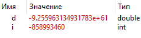
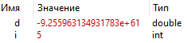
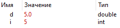

МИНИСТЕРСТВО НАУКИ  И ВЫСШЕГО ОБРАЗОВАНИЯ РОССИЙСКОЙ ФЕДЕРАЦИИ 
Федеральное государственное автономное образовательное учреждение высшего образования 
"КРЫМСКИЙ ФЕДЕРАЛЬНЫЙ УНИВЕРСИТЕТ им. В. И. ВЕРНАДСКОГО" 
ФИЗИКО-ТЕХНИЧЕСКИЙ ИНСТИТУТ 
Кафедра компьютерной инженерии и моделирования

 
<h3 align="center">Отчёт по лабораторной работе № 4  по дисциплине "Программирование"</h3>
  

студента 1 курса группы ПИ-б-о-201(2) Котляра Даниила Евгеньевича 
направления подготовки 09.03.04 "Программная инженерия"

  
<table>
<tr><td>Научный руководитель  старший преподаватель кафедры  компьютерной инженерии и моделирования</td>
<td>(оценка)</td>
<td>Чабанов В.В.</td>
</tr>
</table>
  

Симферополь, 2021

<h2>Цель</h2>
1. Установить фреймворк Qt;
2. Изучить основные возможности создания и отладки программ в IDE Qt Creator.

<h2>Постановка задачи</h2>

Настроить рабочее окружение, для разработки программного обеспечения при помощи Qt и IDE Qt Creator, а также изучить базовые возможности данного фреймворка.

<h2>Выполнение работы</h2>

<h4>Вопросы:</h4>

1. Как изменить цветовую схему (оформление) среды?

Инструменты -> Параметры -> Среда -> Интерфейс -> Цвет

2. Как закомментировать/раскомментировать блок кода средствами Qt Creator? Имеется ввиду комбинация клавиш или пункт меню.

Ctrl+/

3. Как открыть в проводнике Windows папку с проектом средствами Qt Creator?

4. Какое расширение файла-проекта используется Qt Creator? Может быть несколько ответов.

.cmake, .ninja, .qmake...

5. Как запустить код без отладки?

Нажать зелёный треугольник слева

6. Как запустить код в режиме отладки?

Нажать зелёный треугольник с багом (с жучком) слева

7. Как установить/убрать точку останова (breakpoint)?

Нажать слева от цифры необходимой строки

<h4>Значения переменных с точками останова в строках:</h4>

i = -858993460 и d = -9.255963134931783e+61 в 6 строке;

Рисунок 1. Точка останова в 6 строке.

i = 5 и d = -9.255963134931783e+61 в 7 строке;

Рисунок 2. Точка останова в 7 строке.

i = 5 и d = 5.0 в 8 строке;

Рисунок 3. Точка останова в 8 строке.