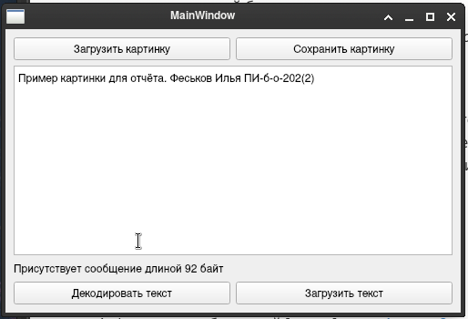
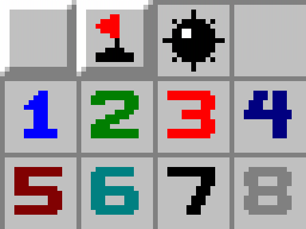

МИНИСТЕРСТВО НАУКИ  И ВЫСШЕГО ОБРАЗОВАНИЯ РОССИЙСКОЙ ФЕДЕРАЦИИ 
Федеральное государственное автономное образовательное учреждение высшего образования 
"КРЫМСКИЙ ФЕДЕРАЛЬНЫЙ УНИВЕРСИТЕТ им. В. И. ВЕРНАДСКОГО" 
ФИЗИКО-ТЕХНИЧЕСКИЙ ИНСТИТУТ 
Кафедра компьютерной инженерии и моделирования

 
<h3 align="center">Отчёт по лабораторной работе № 5  по дисциплине "Программирование"</h3>
  

студента 1 курса группы ПИ-б-о-201(2) 
Котляра Даниила Евгеньевича 
направления подготовки 09.03.04 "Программная инженерия"

  
<table>
<tr><td>Научный руководитель  доцент кафедры  компьютерной инженерии и моделирования</td>
<td>(оценка)</td>
<td>Чабанов В.В.</td>
</tr>
</table>
  

Симферополь, 2020

## Цель
1. Изучить базовые встроенные элементы фреймворка Qt предназначенные для создания приложений с графическим интерфейсом пользователя (GUI);
2. Изучить сигнально-слотовую систему, как один из способов организации взаимодействия компонентов GUI;
3. Получить практический навык работы с побитовыми операторами.

## Постановка задачи
Создать десктоп приложение с GUI позволяющее сохранять текстовую информацию в изображение формата png без видимого изменения исходного изображения. Приложение должно позволять сохранять текст в картинку и извлекать текст из картинки.

## Выполнение работы
доделать

## Дополнительные приложения
1. 
2. Рик, GTA IV
3. 

## Вывод
Я узнал, что Qt - это очень гибкий кросс-платформенный фреймворк для создания графических приложений.
